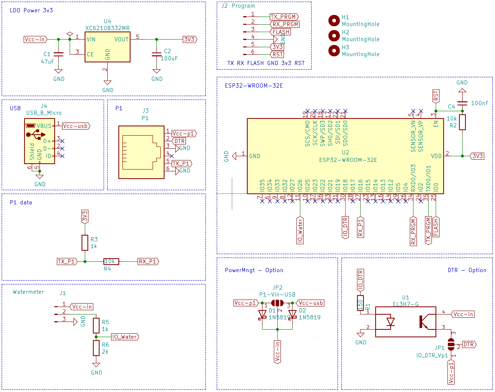
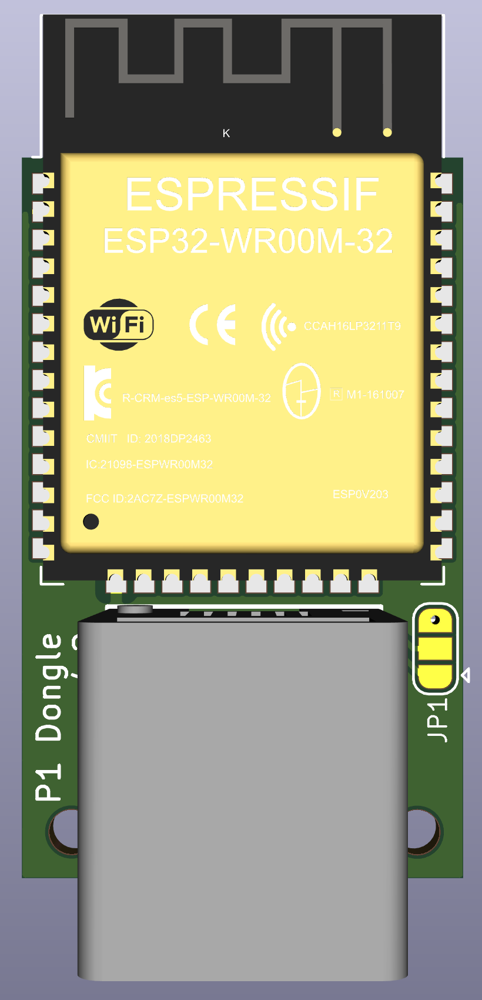

# Slimmemeter P1 Dongel voor ESP32
Doorontwikkeling van de P1 dongel naar een ESP32 versie.

## Kenmerken
- ESP32 WROOM 32E
- 6P6C aansluiting
- optioneel: USB micro voeding
- signaal inversie door de ESP zelf (hardware niet nodig)
- DTS signaal (aan/uitzetten van P1 signaal) keuze altijd aan of getriggert
- te gebruiken voor BE en NL
- aansluiting voor watersensor

## SCHEMA
Gekozen voor de ESP32 WROOM 32E.
Op de pcb zitten de volgende modules:
- spanningsregulator voor het naar 3.3Volt brengen van de P1 spanning.
- de ESP32 natuurlijk
- Aansluiting voor de P1
- usb voeding
- aansluiting en logica watersensor

Totale schema ziet er zo uit:
 

Omgezet naar een board ziet dit er zo uit:
Bovenkant             |  Onderkant |  Eindresultaat
:-------------------------:|:-------------------------:|:-------------------------:
  |   | 

Afmeting van de print is: 20 x 32mm

## SOFTWARE
De software is geport van de V3 hardware. Daarnaast zijn er een aantal specifieke aanpassingen gedaan, namelijk:
- cpu 0 handeld de P1 telegrammen af (naast de standaard ESP taken)
- cpu 1 handeld de rest af
Instructie is te vinden in de [setup/dsmr-api](setup/dsmr-api/README.md) folder.

## Hardware maken of aanschaffen
Je kan je eigenhardware maken of deze los / compleet aanschaffen. Wil je deze aanschaffen dan kan je mij altijd een DM sturen. De oplossing is ook Plug-and-play te koop.