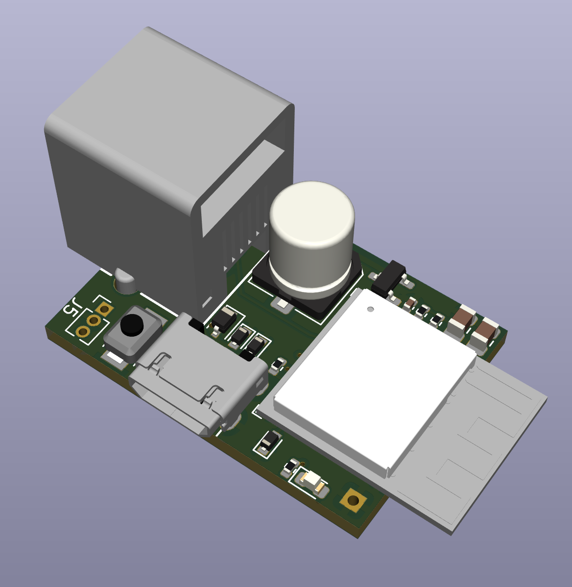

# Slimmemeter P1 Dongel Pro (ESP32)
Doorontwikkeling van de P1 dongel naar een Pro / ESP32C3 versie.

## Wat is er zo Pro aan?
- ESP32 C3 SOC die ca 25% krachtiger is
- Flash via usb poort zonder additionele jtag/adapter
- State of the art architectuur die vooral veiliger is
- download / reset / reboot knop aanwezig
- ESD beveiliging op de ingangspoorten
- iets compacter (15%) dan de ESP8266 Dongle

## Kenmerken
- ESP32C3 Mini 1 SOC
- 4MB flash
- 6P6C aansluiting
- USB micro aansluiting voor usb voeding
- signaal inversie door de ESP zelf
- te gebruiken voor BE, NL, DK, SE, Lux 2/3/4.x en 5.x meters
- aansluiting voor watersensor
- multifunctioneel drukknopje
- Status led
- USB flashing
- ESD beveiliging

Omgezet naar een board ziet dit er zo uit:
Bovenkant             |  Onderkant |  Eindresultaat  
:-------------------------:|:-------------------------:|:-------------------------:
  |   | 

Afmeting van de print is: 20 x 28mm

## SOFTWARE
De DSMR-API software is een doorontwikkeling van de ESP32 WROOM 32E software.
Instructie is te vinden in de [setup/dsmr-api](https://github.com/mhendriks/DSMR-API-V2/tree/master/manual/dsmr-api/README.md) folder.

De ESPHome firmware werkt ook fantastisch op deze Dongle Pro.

## Documentatie 
De handleiding is te vinden in [Documentatie P1 Dongle Pro](https://docs.smart-stuff.nl/) 

## Hardware maken of aanschaffen
Je kan je eigen hardware maken of deze aanschaffen. Wil je deze aanschaffen neem dan een kijkje op <a href="https://smart-stuff.nl/shop/" target="_blank">smart-stuff.nl</a>