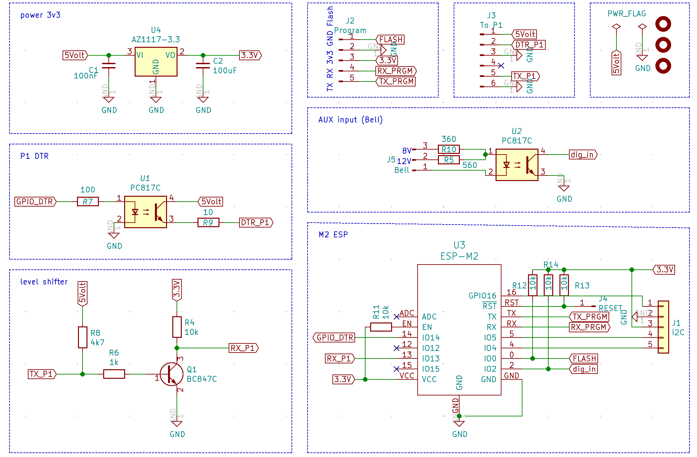
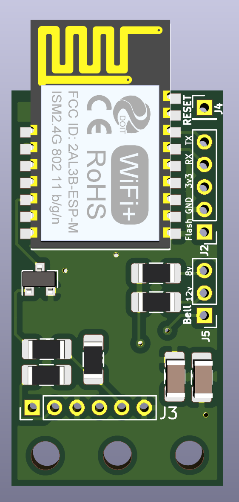
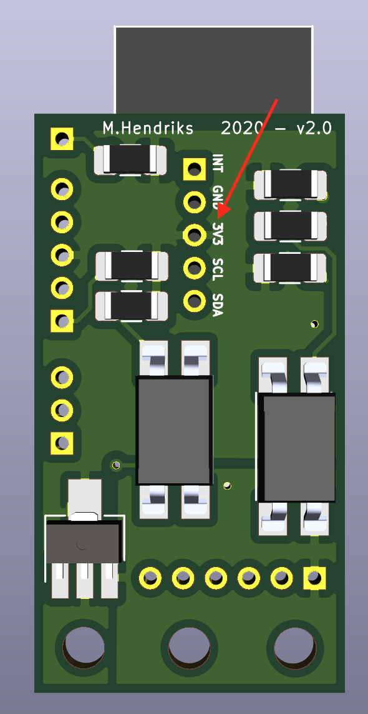
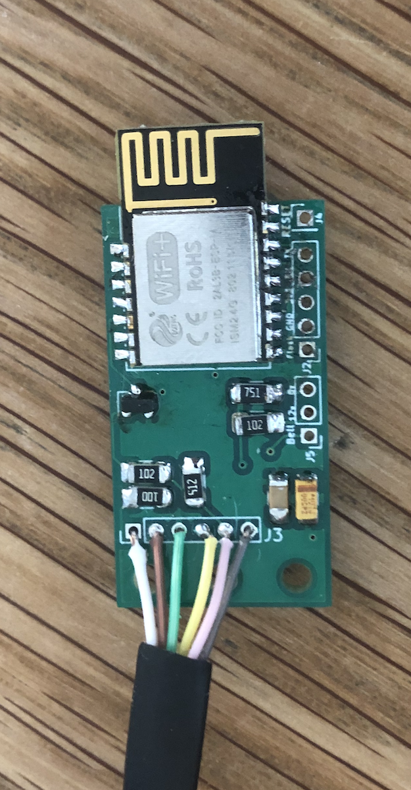

# Slimmemeter P1 Dongel voor ESP32
Doorontwikkeling van de ESP8266 P1 dongels naar een ESP32 versie.
Kenmerken
- ESP32 WROOM 32E
- 6P6C aansluiting
- optioneel: USB micro voeding
- optioneel: Power muxer om automatisch te schakelen tussen usb en p1 voeding
- optioneel: Bridge driver voor het aansluiten van een extra P1 reader
- signaal inversie door de ESP zelf (hardware niet nodig)
- DTS signaal (aan/uitzetten van P1 signaal) altijd hoog zodat de slimme meter om de 1 sec (SMR 4.x en ouder) een signaal afgeeft
- te gebruiken voor BE en NL

## SCHEMA
Gekozen voor iets compactere ESP-M2 (ESP8285) vooral omdat de secundaire seriele interface van de ESP bereikbaar is op de M2 en niet op de M3. 
Op het printje zitten de volgende modules:
- spanningsregulator voor het naar 3.3Volt brengen van de P1 spanning.
- de ESP32 natuurlijk
- Aansluiting voor de P1
- Aansluiting voor bridge
- logica voor power mux en usb voeding
- logica voor bdrige

Alle modules samen zie je in het onderstaande schema.
 

In het schema is rekening gehouden met het aansluiten van een deurbel van 12 of 8 Volt AC. De weerstanden zorgen dan voor een juiste werking van de optocoupler. Er kan ook een andere digitale of analoge bron worden aangesloten. Zorg dan even voor de juiste weerstanden. De diode in de optocoupler heeft 1.2V en 20mA typical nodig.

Omgezet naar een board ziet dit er zo uit:
Bovenkant             |  Onderkant |  Eindresultaat
:-------------------------:|:-------------------------:|:-------------------------:
  |   | 

Afmeting van de print is: 

## SOFTWARE
De software is geport van de V3 hardware. Daarnaast zijn er een aantal specifieke aanpassingen gedaan, namelijk:
- cpu 0 handeld de P1 telegrammen af
- cpu 1 handeld al het andere verkeer af
Instructie is te vinden in de [setup/dsmr-api](setup/dsmr-api/README.md) folder.

# Hardware maken of aanschaffen
Je kan je eigenhardware maken of deze los / compleet aanschaffen. Wil je deze aanschaffen dan kan je mij altijd een DM sturen. De oplossing is ook Plug-and-play te koop met Tasmota of DSMR-API firmware.