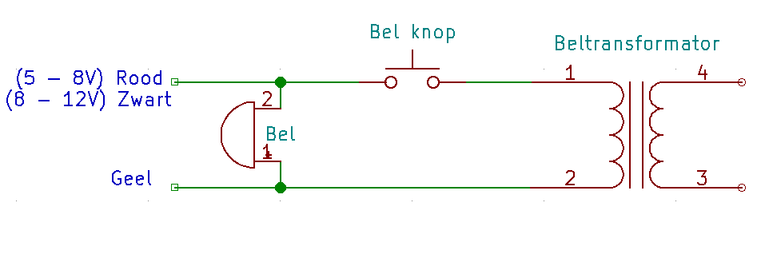

# Aansluiten Aux (Bel)
Als de p1 adapter de optie heeft om een extra signaal aan te bieden dan kan daar bijvoorbeeld een deurbel op aangesloten worden. In de praktijk kan er elke bron worden aangesloten op de P1 adapter mits deze een signaal geeft tussen de 5 en 12Volt. Dit kan een AC of DC signaal zijn zolang deze maar een pulse of pulsen geeft. Het signaal gaat een optocoupler in op de p1 adapter en is daardoor galvanisch gescheiden van de overige logica.

## Aftakken signaal
In onderstaande overzicht staat een reguliere deurbelschakeling. Het signaal bij de bel dient afgetakt te worden en naar de P1 adapter te gaan. 




## Aansluitingen op de P1 adapter
Uit de P1 adapter komen drie draadjes, namelijk:

- Rood : 8 - 12 Volt (weerstand 560 ohm)
- Zwart: 5 - 8 Volt (weerstand 330 ohm)
- Geel : ground

Advies is om eerst rood/geel te gebruiken. Mocht dit niet lukken, omdat de spanning te laag is, de zwart/geel combinatie.

## Software
Een opgevangen signaal wordt ALLEEN omgezet naar een MQTT signaal indien dit signaal minimaal 3 pulsen heeft gegeven. Zodra er 3 of meer pulsen zijn gedetecteerd wordt het onderstaande MQTT bericht gestuurd. Dan volgt er een timeout van ±3000ms (om te voorkomen dat er maar berichten blijven komen). Elke ±500ms checkt de logica of er pulsen zijn binnen gekomen.

```
DSMR-API/AUX met payload "Signal"
```