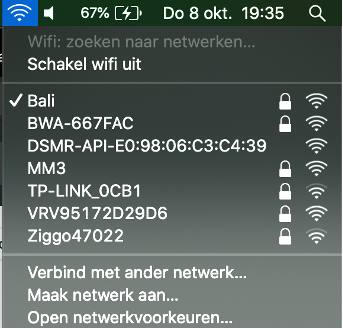
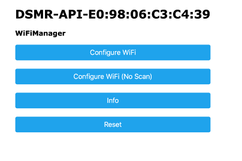
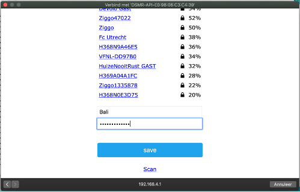
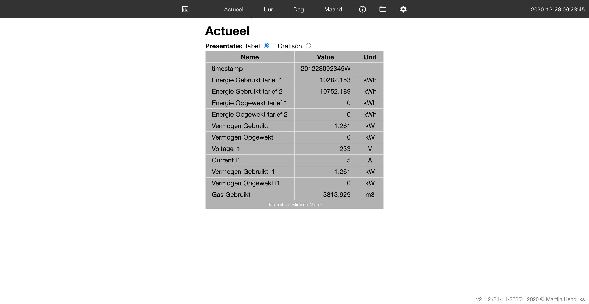
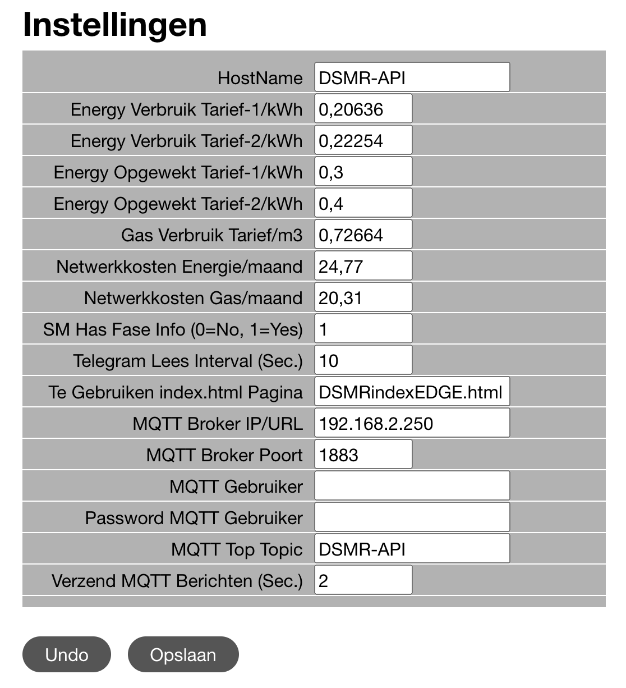
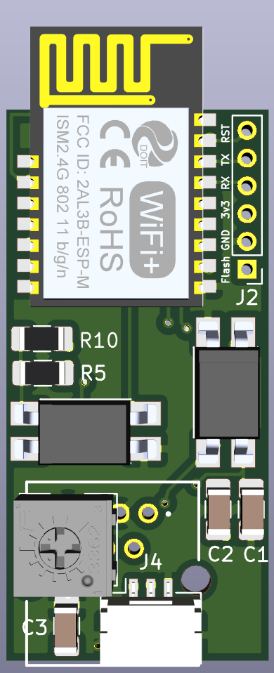

# **Slimmemeter DSMR-API adapter**

Dit document beschrijft de installatie en configuratie van de DSMR API op hardware versie 2.0. De hardware komt normaal gesproken met werkende software. Wil je deze aanpassen ga dan naar het onderdeel software.

Dit project is een doorontwikkeling op basis van het pionierswerk van Willem Aandewiel. Er zijn aanpassingen doorgevoerd in de weblayout, het laden van de pagina's en interface. MQTT interface is ongewijzigd. API interface is versie 2.x en daarmee aangepast (andere structuur).

Zie voor meer informatie [https://mrwheel-docs.gitbook.io/dsmrloggerapi/](https://mrwheel-docs.gitbook.io/dsmrloggerapi/)

**Configuratie Wifi**

Na het aansluiten van de adapter op je P1 ingang van je slimmemeter bouwt de adapterals eerste een eigen Wifi hotspot op ten behoeve van configuratie. Deze hotspot is te herkennen door de Wifinaam DSRM-API-?????.

Zorg dat je met je computer of mobieldevice contact maakt met dit netwerk. Automatisch wordt een updatescherm getoond waarin de Wifi settings te zien zijn. Zie onderstaande voorbeeld op MacOS.

Zorg dat je met je computer of mobiel device contact maakt met dit netwerk, door hier op te klikken. Automatisch wordt een scherm getoond waarin de WifiManager te zien is. Zie onderstaande plaatje.

1. Klik op &quot;Configuratie Wifi&quot;

1. Klik op het uw netwerknaam en vul daarna het bijbehorende en **wachtwoord** in bij Password.
2. Druk op &quot;Save&quot;
3. Adapter zal op nieuwe opstarten en u kunt het scherm sluiten.

Vanaf dit moment zal de adapter te vinden zijn via: [http://dsmr-api.local/](http://dsmr-api.local/)

Deze naam is aanpasbaar (via configuratie).

**Uitlezen Slimmemeter**

Er zijn drie manieren om via de adapter de slimmemeter uit te lezen, namelijk:

1. Via de webinterface van de Slimmemeter ([http://dsmr-api.local/](http://dsmr-api.local/))
2. Via de rest api ([http://dsmr-api.local/api/v2/hist/hours](http://dsmr-api.local/api/v2/hist/hours)); zelf ophalen van de gegevens op gewenste moment; zie API info in de webinterface voor meer informatie
3. Via MQTT; adapter pusht elke 5 seconde de gegevens naar de mqtt broker; zie hieronder de configuratie van mqtt

**Webinterface**

Het hoofdscherm opent met onderstaande pagina. Kan zijn dat de tabel nog leeg is in de eerste 30 seconden na opstarten.

In de menu zijn de volgende opties opgenomen

1. Actueel -\&gt; samenvatting van de verschillende grootheden
2. Per Uur / Per Dag / Per Maand -\&gt; de verbruikscijfers weergegeven per dag/maand/jaar
3. Telegram -\&gt; ruwe data uit de slimme meter
4. All Fields -\&gt; alle slimme meter data netjes geformateerd
5. Systeem info -\&gt; informatie over de adapter zoals versie, capaciteit
6. APIDocs -\&gt; informatie over de mogelijkheid om de gegevens op afstand te kunnen uitlezen
7. File symbool -\&gt; kunnen de bestanden op de adapter geraadpleegd/verwijderd of geupload worden
8. Wieltje -\&gt; systeeminstellingen.

**Configuratie**

Open in de browser [http://dsmr-api.local/](http://dsmr-api.local/)

Druk op het wieltje rechts in het menu. Het onderstaande settingsscherm is zichtbaar.

1 - MQTT

Voor het activeren van de mqtt interface dient het onderstaande ingesteld te worden.

1. HostName (mqtt broker)
2. MQTT Broker IP/URL: (bv: 192.168.2.250)
3. Port (default: 1883)
4. MQTT Top Topic van deze adapter (default: DSMR-API)
5. Optioneel: wachtwoord en Username
6. Verzenden MQTT berichten: in welke frequentie de berichten verzonden worden. In dit voorbeeld elke 2 seconden terwijl de leesfrequentie 10 seconden is. Beetje onzinnig de huidige instelling ;-) aangezien er dan 5 x dezelfde waarde verzonden wordt.
7. Op Opslaan drukken rechtsboven om de settings op te slaan en mqtt te activeren

2 – Tarieven

In hetzelfde settingsscherm zijn ook de tarieven in te vullen zodat bij de kostenberekening de bedragen komen te staan. Pas deze aan op basis van je contract met je energie leverancier.

Let op! de bedragen in de adapter kunnen afwijken van je echte nota en zijn daarom indicatief

3 – Overige instellingen

De frequentie van uitlezen kan ingesteld worden.

Daarnaast ook de frequentie van toesturen van de MQTT gegevens.

**Flashen / Updaten**

Flashen dient via een FTDI interface te gebeuren. Op J2 zitten de aansluitingen voor deze interface. 
De pinout is :

1. Flash (vierkante pad / Rode pijl); Flash naar GND en opnieuw opstarten om in de program mode te komen
2. GND
3. 3Volt
4. RX
5. TX
6. Reset = GND

De software is te vinden op [https://github.com/mhendriks/DSMR-API-V2](https://github.com/mhendriks/DSMR-API-V2)

**Aansluiten extra signaal**

Zie [setup/aux_(bel)](aux_(bel)/README.md) voor meer details

**Instellen Domotica oplossing**

Home Assistant

Zie voorbeeld op [https://mrwheel-docs.gitbook.io/dsmrloggerapi/integratie-met-home-assistant](https://mrwheel-docs.gitbook.io/dsmrloggerapi/integratie-met-home-assistant)